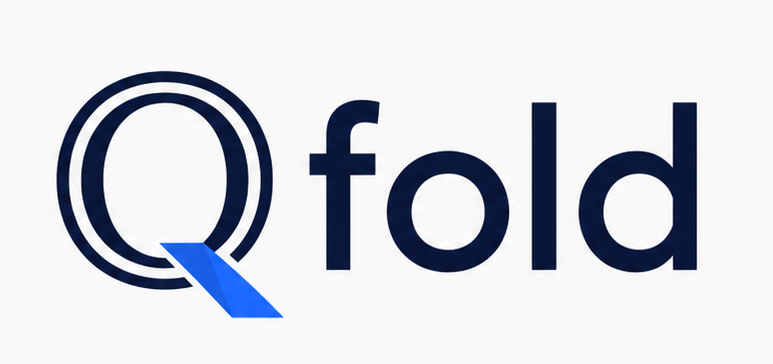
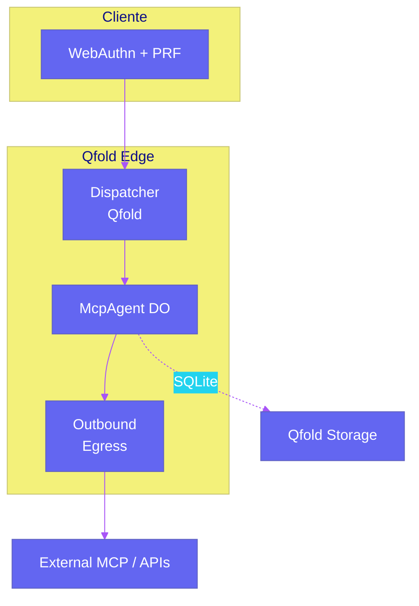
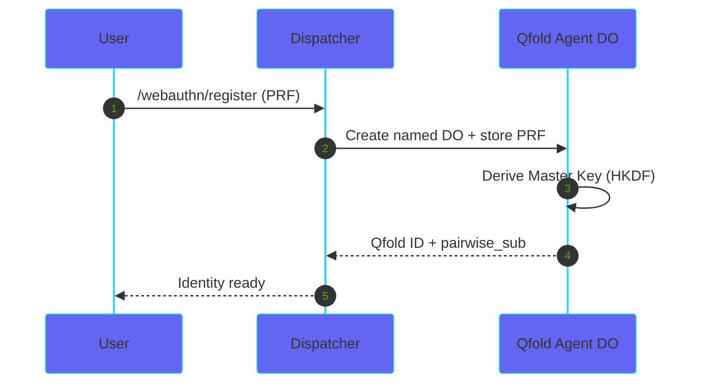
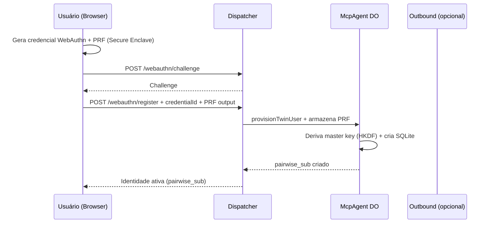
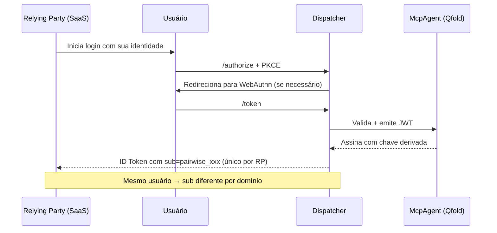
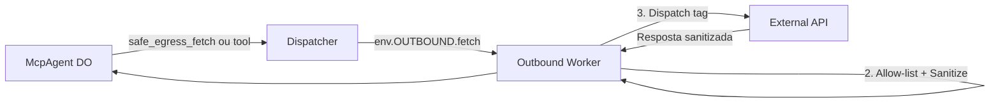
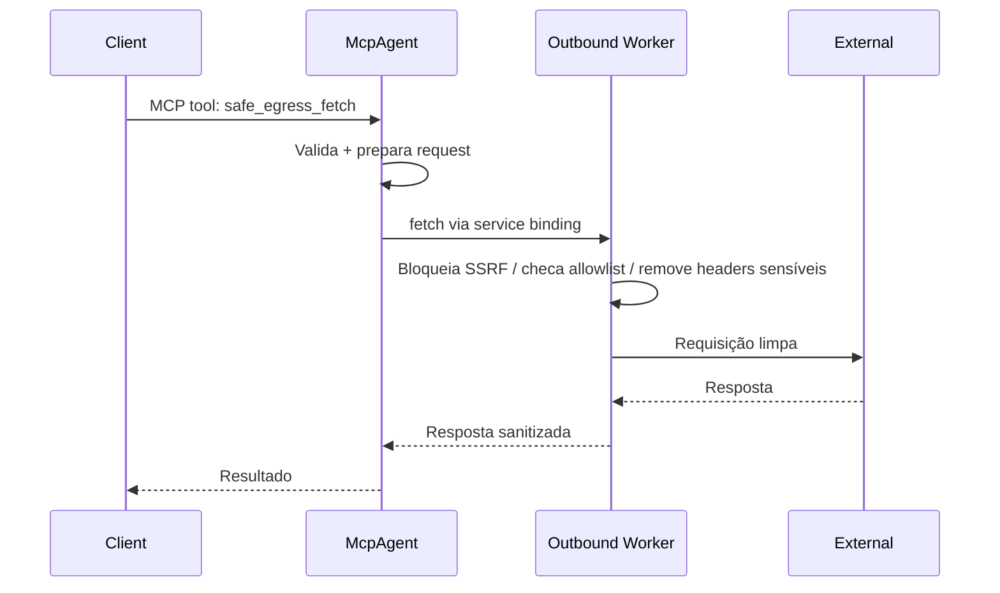
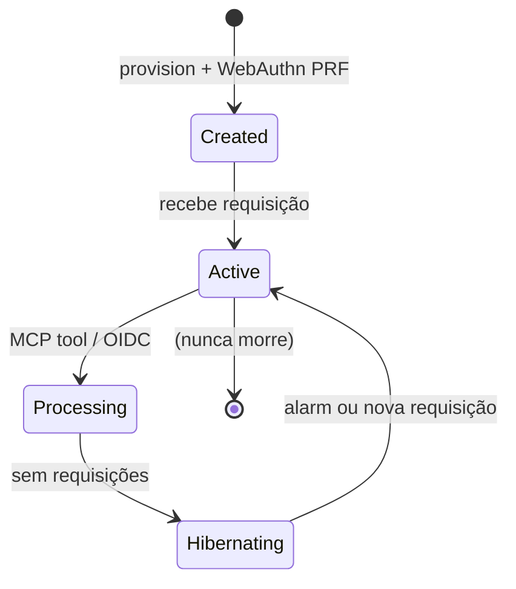
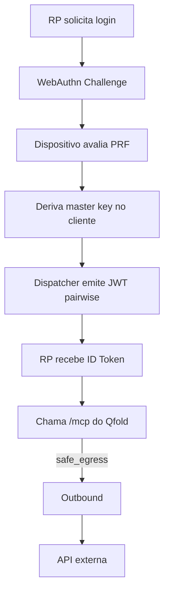

# Qfold — Identidade Federada AI-Native na Cloudflare

<p align="center">
  
</p>

<p align="center">
  <a href="https://developers.cloudflare.com/workers/"></a>
  <a href="https://www.typescriptlang.org/"></a>
  <a href="https://github.com/"></a>
  
</p>

> **Cada usuário = um agente vivo, isolado e soberano.**

Sistema de identidade universal baseado em **Cloudflare Workers + Durable Objects**, implementando o paradigma **User-as-Agent** descrito na arquitetura "Arquitetura de Sistemas Nativos de Inteligência Artificial".

## Status de Produção (Julho 2026)

**Deployed e funcionando:**

- **Main Worker**: https://qfold.voither.workers.dev
- **Outbound Worker** (egress seguro): https://qfold-outbound.voither.workers.dev

Recursos provisionados:
- KV Namespaces (Sessions, Profiles, Rate Limits)
- R2 Buckets (qfold-assets, qfold-backups)
- D1 Databases (qfold-db + qfold-audit) com schema aplicado
- Durable Objects (McpAgent + UserDurableObject)
- Service Binding para Outbound
- JWT Secret configurado

> **Atenção**: Workers for Platforms (Dispatch Namespace em modo untrusted) ainda não está habilitado na conta. O sistema atualmente usa **named Durable Objects** como principal mecanismo de isolamento por usuário.

---

## Visão Geral da Arquitetura

O sistema transforma cada identidade registrada em um **Qfold Identity**: um agente computacional autônomo, com sua própria memória (SQLite + R2), chaves criptográficas derivadas via WebAuthn PRF, e capacidade de atuar como seu próprio Identity Provider (OIDC) de forma pairwise.

### Diagrama de Componentes (Alto Nível)

```mermaid
%%{init: {"theme": "base", "themeVariables": {"primaryColor": "#6366f1", "primaryTextColor": "#ffffff", "primaryBorderColor": "#4f46e5", "lineColor": "#22d3ee", "secondaryColor": "#0f172a", "tertiaryColor": "#1e2937"}}}%%
graph TD
    subgraph "Cliente / Dispositivo"
        A[Browser + WebAuthn + PRF]
    end

    subgraph "Cloudflare Edge"
        B[Dispatcher Worker<br/>OIDC + Routing]
        C[McpAgent DO<br/>por usuário]
        D[Outbound Worker<br/>Egress Control]
    end

    subgraph "Storage por Qfold"
        E[SQLite (DO local)]
        F[R2 Assets / Backups]
        G[KV Sessions]
        H[D1 Audit + Shared]
    end

    subgraph "Serviços Externos"
        I[OpenAI / Anthropic / MCP Servers]
    end

    A -->|WebAuthn + PRF| B
    B -->|Pairwise OIDC| C
    B -->|named DO| C
    C -->|Ferramentas MCP| D
    D -->|Sanitizado + Allowlist| I
    C --> E
    C --> F
    B --> G
    C --> H
```

### Arquitetura com Cores da Marca Qfold



### Fluxo de Provisionamento Qfold (Estilizado)



### Fluxo Completo de Registro (WebAuthn + Criação do Twin)



### Fluxo OIDC com Pairwise Subject (Privacidade)



### Controle de Egress (Outbound Worker)



---

## Workflows Principais

### 1. Registro de Nova Identidade

1. Cliente chama `/webauthn/challenge`
2. Dispositivo gera passkey + avalia extensão PRF
3. Cliente envia para `/webauthn/register`
4. Sistema cria McpAgent DO nomeado
5. Deriva chave mestra (nunca sai do dispositivo + DO)
6. Retorna `pairwise_sub`

### 2. Autenticação em Terceiros (OIDC)

1. Terceiro redireciona para `/authorize`
2. Dispatcher valida via WebAuthn (se necessário)
3. Emite JWT com `sub` calculado deterministicamente por `userId + sector`
4. `sub` é sempre diferente por Relying Party

### 3. Execução de Ferramentas pelo Agente (MCP + Egress Seguro)



### 4. Hibernação e Estado

- Durable Object hiberna automaticamente após inatividade.
- `alarm()` limpa sessões expiradas.
- Estado persistido em SQLite local do DO + R2.

---

## Stack Tecnológico

- **Runtime**: Cloudflare Workers (V8 Isolates)
- **State**: Durable Objects + SqlStorage (SQLite)
- **Storage**: KV, R2, D1
- **OIDC**: Implementação manual + suporte a PKCE + pairwise
- **MCP**: @modelcontextprotocol/sdk (Streamable HTTP)
- **Crypto**: Web Crypto API (AES-GCM, HKDF, HMAC)
- **Linguagem**: TypeScript

---

## Estrutura do Projeto

```
qfold/
├── src/
│   ├── index.ts                 # Dispatcher + OIDC endpoints + routing
│   ├── McpAgent.ts              # Agente principal (DO + MCP tools + crypto)
│   ├── outbound-worker.ts       # Egress seguro
│   ├── durable/UserDurableObject.ts
│   ├── utils/
│   │   ├── crypto.ts            # signJWT, AES-GCM, derive PRF
│   │   ├── pairwise.ts
│   │   ├── identity.ts          # provision
│   │   └── d1.ts                # audit + schema
│   └── types.ts
├── d1-migrations/
├── migrations/                  # Para wrangler d1
├── scripts/
│   └── create-cloudflare-resources.sh
├── wrangler.jsonc               # Config produção
├── wrangler.outbound.jsonc
├── DEPLOY.md
└── README.md
```

---

## Como Começar (Desenvolvimento Local)

```bash
npm install

# Dev
npm run dev

# Typecheck
npm run typecheck
```

### Criar Recursos no Cloudflare

```bash
./scripts/create-cloudflare-resources.sh production

# Depois preencha os IDs reais no wrangler.jsonc
```

### Aplicar Migrations

```bash
npm run d1:migrate:prod
npm run d1:migrate:audit:prod
```

### Deploy

```bash
npm run deploy
```

---

## Segurança e Princípios

- **Zero-Knowledge**: Chave mestra derivada no dispositivo via WebAuthn PRF. Cloudflare nunca vê a chave.
- **Pairwise Subjects**: Impossível correlacionar identidade entre diferentes SaaS.
- **Egress Control**: Todo tráfego externo passa pelo Outbound Worker (SSRF + allow-list + remoção de headers sensíveis).
- **Isolamento**: Cada Qfold tem seu próprio Durable Object + SQLite.
- **Hibernação**: Custo marginal zero quando o agente está ocioso.

---

## Diagramas Adicionais

### Ciclo de Vida do McpAgent DO



### Fluxo de Autenticação Completo



---

## Próximos Passos / Roadmap

- [ ] Habilitar Workers for Platforms + Dispatch Namespace real
- [ ] Suporte completo a `workers-oauth-provider`
- [ ] Custom domain + rota `identity.qfold.com`
- [ ] Mais ferramentas MCP (RAG local, memory tools, ACP real)
- [ ] UI de gerenciamento de identidades
- [ ] Testes de integração + load test com hibernação
- [ ] Documentação de como usar como IdP em outros SaaS

---

## Referências

- Arquitetura original: `Arquitetura Identidade Cloudflare AI.pdf`
- Cloudflare Durable Objects
- Model Context Protocol (MCP)
- WebAuthn PRF Extension
- OpenID Connect Pairwise Identifiers

---

**Construído com ❤️ seguindo o paradigma de identidade soberana e agentes nativos na edge.**

Se quiser contribuir ou testar, abra uma issue ou PR.
